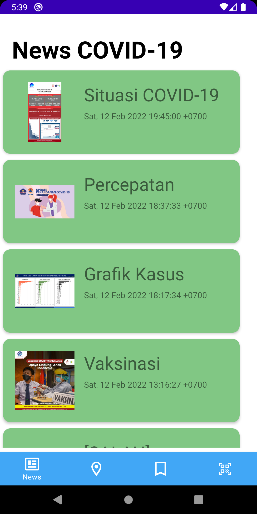
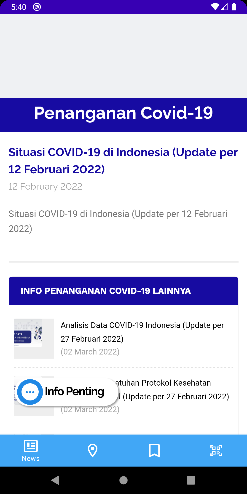
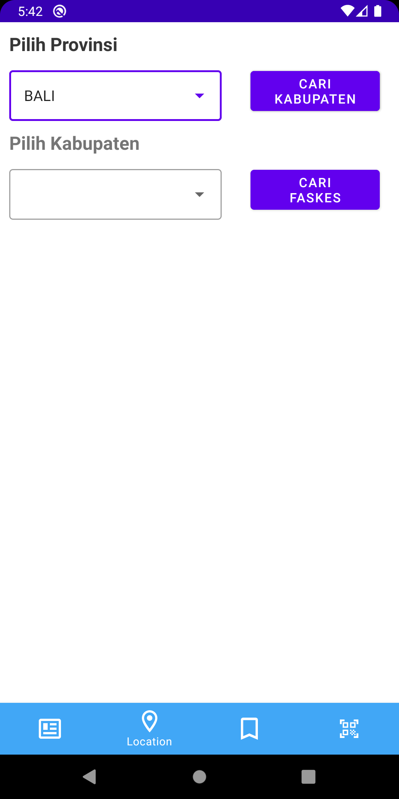
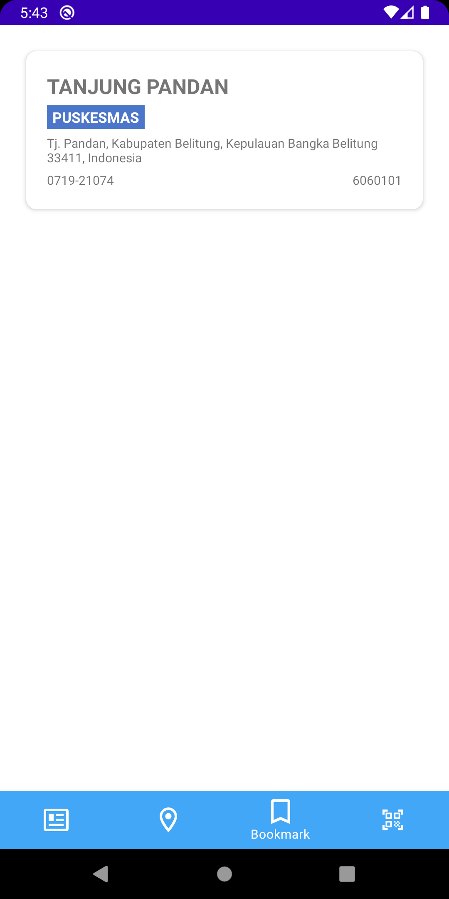

# IF3210-2022-Android-64

## Deskripsi Aplikasi
Aplikasi ini dapat: 
* Menampilkan Berita COVID-19 di Indonesia menggunakan API Berita PerluDilindungi
* Menampilkan Daftar Faskes untuk Vaksinasi menggunakan API Faskes PerluDilindungi
* Menampilkan Detail Informasi Faskes yang memiliki tombol yang terhubung dengan Google Maps
* Menampilkan Daftar Bookmark Faskes
* Melakukan "Check-In" menggunakan QR Code dengan API Server PerluDilindungi

## Cara kerja
* News: 
    * Membaca berita dari API Berita PerluDilindungi dengan Library [Volley](https://developer.android.com/training/volley/index.html)
    * Menampilkan berita dalam bentuk Card dengan RecyclerView
    * Otomatis muncul tombol untuk melihat detail berita
    * Bila di klik tombol detail berita, akan menampilkan detail berita dalam bentuk WebView
    * Pengguna otomatis akan berada pada bagian ini ketika aplikasi dijalankan
* Per-Faskes-an
* Check In:  
    * Meminta izin untuk akses kamera dan location
    * Jika location service belum menyala, maka muncul pop up untuk menyalakan location
    * Menyalakan kamera dan melakukan scan QR code dengan library [budiyev](https://github.com/yuriy-budiyev/code-scanner). Jika kamera tidak terdeteksi maka akan muncul pesan error
    * Jika QR code terbaca, maka akan mengirimkan pesan QR code serta posisi latitude & longitude ke API Server PerluDilindungi dengan Library [Retrofit](https://square.github.io/retrofit/)
    * Jika respon API sukses, maka akan muncul pop up berhasil atau gagal check in berdasarkan pesan QR code. Jika respon API gagal, maka akan muncul pesan error

## Library
* News: Volley digunakan untuk melakukan fetch data dari API Berita PerluDilindungi, Volley digunakan karena lebih cepat dari HttpURLConnection dan menghemat waktu. Selain itu Volley juga lebih mudah digunakan dan lebih sederhana.

## Screenshot aplikasi
<!-- show all pictures from screenshots/ -->
<!-- news.png -->

<!-- SEMUANYA DLM PNG YAGESYA -->
<!-- DIREKTORI GAMBAR DI SCREENSHOTS/<FILE>.PNG YAGESYA -->

## Pembagian Tugas
Gayuh Tri Rahutami (13519192) :
1. Cari faskes
2. Detail faskes (cek atas)
3. Daftar bookmark faskes
4. Integrasi aplikasi

Ryo Richardo (13519193) :
1. Check-in
2. Integrasi aplikasi

Allief Nuriman (13519221) :
1. Landing page
2. List berita
3. Detail berita
4. Bottom Navbar
5. Integrasi aplikasi

